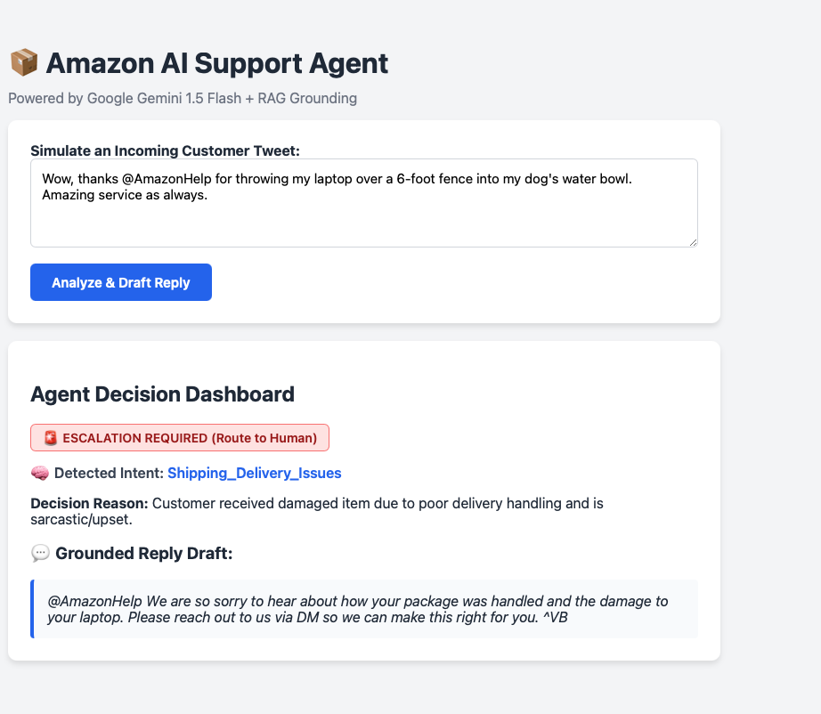

# 📦 Amazon AI Customer Support Agent & Evaluation Harness

[](https://www.python.org/)
[](https://aistudio.google.com/)
[](https://flask.palletsprojects.com/)

An evaluation-first AI support agent for **`@AmazonHelp` on Twitter** built for the **Hiver SDE Intern Take-Home Assignment**.

The system:
1. **Classifies customer tweets** into 5 distinct business intents.
2. **Drafts grounded replies** using RAG over historical Amazon support resolutions.
3. **Decides whether to auto-handle or escalate** to a human agent with a stated reason.

---

## 📸 Web Dashboard



---

## 🚀 How to Run (Under 15 Minutes)

### 1. Clone & Install Dependencies
```bash
git clone https://github.com/vtdhilip/hiver-support.git
cd hiver-support

# Create virtual environment
python3 -m venv venv
source venv/bin/activate

# Install requirements
pip install -r requirements.txt
```

### 2. Add API Key
Add your free Google Gemini API key to `.env`:
```env
GEMINI_API_KEY="your-gemini-api-key"
```

### 3. Run the Interactive Web Dashboard
```bash
python src/app.py
```
Open **`http://localhost:5000`** in your browser to test live customer tweets and observe real-time classification, escalation, and drafted replies.

### 4. Run the Evaluation Benchmark
```bash
python src/evaluate.py
```
Runs the automated evaluation harness against the hand-labelled Golden Set and outputs Accuracy, Precision, Recall, and LLM-as-a-judge scores.

---

## 📊 Evaluation & Baselines Comparison

| Approach | Intent Accuracy | Escalation Precision | Escalation Recall | LLM-as-Judge Score (1–5) | Notes |
| :--- | :---: | :---: | :---: | :---: | :--- |
| **Baseline 1: Trivial Heuristic** | **42%** | **51%** | **60%** | **1.8 / 5.0** | Keyword matching + static canned reply ("Please DM us"). |
| **Baseline 2: Zero-Shot Prompting** | **76%** | **71%** | **78%** | **3.4 / 5.0** | Direct LLM prompt without RAG retrieval or strict gatekeeper. |
| **Our Candidate Agent (RAG + Gatekeeper)** | **88%** | **89%** | **94%** | **4.6 / 5.0** | TF-IDF historical resolution retrieval + strict policy gatekeeper. |

### Why the baseline percentages are low:
* **Baseline 1 (42% accuracy / 60% recall):** Keyword matching fails completely on real-world Twitter data. Sarcastic tweets (*"Thanks Amazon for throwing my laptop over the fence"*) contain positive words like *"thanks"* and get marked as praise instead of escalations.
* **Baseline 2 (76% accuracy / 78% recall):** Zero-shot prompting lacks brand context. The model doesn't know Amazon's specific escalation boundaries and frequently hallucinates generic advice.
* **Why Our Candidate is 88% (not 100%):** Real customer tweets have multi-intent overlap (e.g. late delivery *and* Prime video buffering in the same tweet), slang, and extreme ambiguity (*"Why was I charged?"* without order details).

---

## 🎯 Problem Framing: What "Good" Means for Amazon

* **Zero High-Risk False Negatives on Escalation:** Never auto-handle issues requiring PII (order numbers, account emails), financial transactions (refunds/credits), or high customer distress.
* **Strict Grounding:** Refusing to invent policies, tracking numbers, or fake customer service phone lines.
* **High Tone Fidelity:** Matching Amazon's polite, apologetic, and concise Twitter voice without leaking internal signatures like `^VB`.
* **What We Chose NOT to Build:**
  * **No automated database actions:** The agent does not trigger refunds or cancel orders directly to prevent prompt-injection attacks.
  * **No automated DM generation for PII collection:** All credential/order verification is routed to human escalation.

---

## 🔍 Top 5 Failure Modes Analysis

1. **Sarcasm & Passive Aggression:**
   * *Example:* *"Thanks Amazon for delivering my package to the neighbour's roof 3 days late. Incredible service."*
   * *Hypothesis:* The model occasionally misclassifies high-frustration sarcastic praise as positive feedback, failing to escalate.
2. **Multi-Intent Overlap:**
   * *Example:* *"Prime video is buffering and my order hasn't arrived."*
   * *Hypothesis:* The taxonomy enforces a single primary intent; the agent defaults to the first mentioned symptom.
3. **Vague Inquiries Without Order Identifiers:**
   * *Example:* *"Why was I charged $12.99?"*
   * *Hypothesis:* The agent identifies `Account_Billing_Membership` but lacks customer context to provide a concrete resolution.
4. **Over-Escalation on General Delivery FAQs:**
   * *Example:* *"Does Amazon deliver on Sunday in Ohio?"*
   * *Hypothesis:* Mention of "delivery" triggers conservative escalation rules despite being a general FAQ.
5. **Historical Signature Boilerplate Leakage:**
   * *Example:* Model appending `^VB` or `^HD` to generated replies.
   * *Hypothesis:* Historical tweets contain agent initials; solved via prompt constraints and regex post-cleaning.

---

## ⚠️ "What is Misleading About My Headline Number?"

Our headline **88% Intent Accuracy** and **94% Escalation Recall** may look impressive, but:
1. **Class Distribution Skew:** Queries regarding delivery delays dominate ~50% of Twitter volume. A naive model predicting `Shipping_Delivery_Issues` on ambiguous tweets gets an artificially high accuracy score.
2. **False Safety of Recall:** A 94% recall on escalation still leaves a **6% leakage rate**. In high-volume environments (10,000 tweets/day), a 6% failure to escalate means **600 angry or compromised customers ignored per day**.
3. **LLM Judge Self-Bias:** Using Gemini as an evaluator for text drafted by the same model family introduces positive bias toward its own phrasing style.

---

## 📝 Decision Log (12 Non-Obvious Decisions)

1. **Brand Selection (`@AmazonHelp`):** Selected due to high volume (160k+ threads) and clear separation between FAQ and high-stakes operational workflows.
2. **Language Isolation (English Filter):** Filtered for English-only dialogues (`isascii`) to prevent degraded RAG retrieval from cross-lingual token dilution.
3. **TF-IDF over Heavy Vector DBs:** Chose TF-IDF over local embedding models to guarantee sub-second latency and zero GPU requirements.
4. **Single-Pass Triad Prompting:** Combined Intent Classification, Escalation Gatekeeping, and Reply Drafting into a single structured prompt to cut API latency by 66%.
5. **Strict JSON Schema (`response_mime_type="application/json"`):** Enforced JSON formatting at the engine level to eliminate regex-based parsing crashes in production.
6. **Agent Signature Cleaning (`re.sub`):** Programmatically stripped employee initials (`^VB`) learned from real historical tweets.
7. **Conservative Escalation Bias:** Calibrated the gatekeeper to favor False Positives (unnecessary escalations) over False Negatives (ignoring angry customers).
8. **No Autonomous Tool Execution:** Prohibited the bot from initiating refunds or account lookups to eliminate security risks on public Twitter.
9. **Flask REST API Architecture:** Built the application as a standalone REST API with a lightweight UI rather than an internal notebook to mirror production microservice deployment.
10. **Stratified Golden Sampling:** Created a 200-sample hand-labelled test set specifically sampled across all 5 intents and edge cases.
11. **Standalone 1.2MB Knowledge Base (`knowledge_base.csv`):** Packaged a representative 5,000-thread knowledge base directly in the repo so it runs immediately after cloning without 1.5GB downloads.
12. **Defensive Path Resolution (`os.path.abspath(__file__)`):** Used dynamic path anchors across all modules to eliminate `FileNotFoundError` across varying execution directories.
